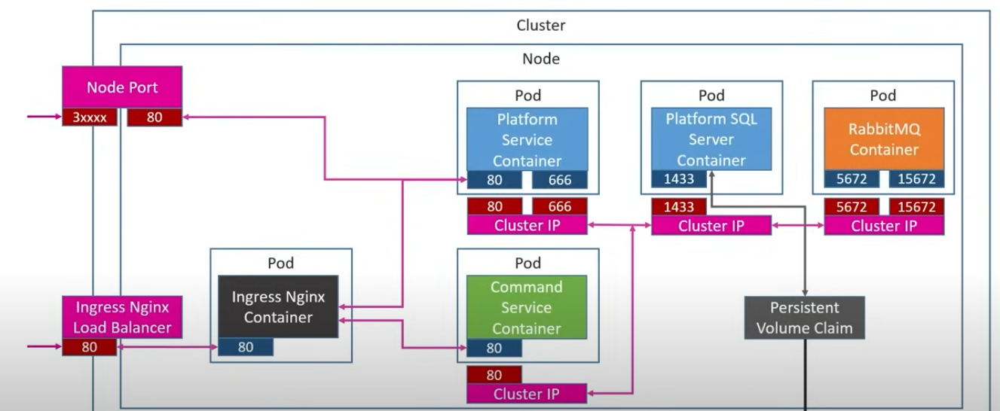

# PlatformApp Microservices

A practical microservices Project built to practice and showcase microservices best practices with .NET 9, gRPC, HTTP, RabbitMQ,ingress Nginx and Kubernetes. The goal is clean code and sound architecture aligned with microservices principles such as independent deployability, clear bounded contexts, and polyglot communication patterns.

The system consists of two services:

- PlatformService
  - ASP.NET Core Web API + gRPC server
  - Stores Platforms (EF Core InMemory in Development, SQL Server in Kubernetes/Production)
  - Exposes REST endpoints and a gRPC endpoint to stream Platforms
  - Publishes Platform events to RabbitMQ (fanout exchange `trigger`)

- CommandService
  - ASP.NET Core Web API
  - Subscribes to Platform events from RabbitMQ and maintains its own read model
  - Consumes PlatformService via gRPC to bootstrap/sync platform data on startup


## Architecture Overview

- Communication patterns
  - Sync: PlatformService → CommandService via HTTP (`HttpClient`) when a Platform is created
  - Async: PlatformService → RabbitMQ (publish) → CommandService (subscribe) for PlatformPublished event
  - gRPC: CommandService → PlatformService to fetch all Platforms

- Data persistence
  - Development: EF Core InMemory for both services
  - Kubernetes/Production: PlatformService uses SQL Server (ClusterIP `mssql-clusterip-srv`); CommandService currently uses InMemory as configured

- Kubernetes
  - Deployments and ClusterIP Services for both services
  - Ingress routes requests by path to each service
  - RabbitMQ and SQL Server run in the cluster

## 🧩 Architecture Diagram



## Repository Layout

- `PlatformService/` — Platform microservice (Web API + gRPC)
- `CommandService/` — Command microservice (Web API + RabbitMQ subscriber + gRPC client)
- `K8S/` — Kubernetes manifests (Deployments, Services, Ingress, RabbitMQ, SQL Server, PVC)

Key references:
- Config (development): `PlatformService/appsettings.Development.json:1`, `CommandService/appsettings.Development.json:1`
- Config (production): `PlatformService/appsettings.Production.json:1`, `CommandService/appsettings.Production.json:1`
- PlatformService startup: `PlatformService/Program.cs:1`
- CommandService startup: `CommandService/Program.cs:1`
- REST controllers:
  - `PlatformService/Controllers/PlatformsController.cs:1`
  - `CommandService/Controllers/PlatformsController.cs:1`
  - `CommandService/Controllers/CommandController.cs:1`
- gRPC contract: `PlatformService/Protos/Platforms.proto:1`
- Messaging:
  - Publisher: `PlatformService/AsyncDataServices/MessageBusClient.cs:1`
  - Subscriber: `CommandService/AsyncDataServices.cs/MessageBusSubscriber.cs:1`


## Prerequisites

For local development:
- .NET SDK 9.0+
- Docker (for RabbitMQ and optionally SQL Server)
- RabbitMQ running and reachable on `localhost:5672` (required; CommandService starts a background subscriber)

Optional for local:
- SQL Server (not required in Development; PlatformService uses InMemory DB)

For Kubernetes:
- kubectl + a local cluster (Docker Desktop, kind, or minikube)
- NGINX Ingress Controller installed in the cluster
- A container registry (Docker Hub or equivalent) to push images


## How To Run Locally

Important startup order and notes:
- Start RabbitMQ first. CommandService requires RabbitMQ at startup for the background subscriber.
- Start PlatformService before CommandService or ensure PlatformService gRPC is reachable. CommandService seeds from PlatformService via gRPC during startup.

1) Start RabbitMQ in Docker

```
docker run -d --name rabbitmq \
  -p 5672:5672 -p 15672:15672 \
  rabbitmq:3-management
```

Management UI is available at http://localhost:15672 (user/pass: guest/guest by default).

2) Run PlatformService (Web API + gRPC)

```
dotnet run --project PlatformService
```

Development URLs (from launch settings):
- REST: `http://localhost:5148`
- HTTPS/REST + gRPC: `https://localhost:7075`

Swagger UI: `http://localhost:5148/swagger` or `https://localhost:7075/swagger`

3) Run CommandService (Web API)

```
dotnet run --project CommandService
```

Development URL (from launch settings):
- REST: `http://localhost:5170` (and `https://localhost:7115`)

Swagger UI: `http://localhost:5170/swagger`

4) Exercise the API

- Create a Platform via PlatformService:
  - POST `http://localhost:5148/api/platforms/create`
  - Body example:
    ```json
    {
      "name": "DotNet",
      "publisher": "Microsoft",
      "cost": "Free"
    }
    ```
  - On success, PlatformService:
    - Sends sync HTTP POST to CommandService (`CommandService` URL from `PlatformService/appsettings.Development.json:10`)
    - Publishes `Platform_Published` event to RabbitMQ exchange `trigger`

- Query Platforms:
  - PlatformService: GET `http://localhost:5148/api/platforms`
  - CommandService: GET `http://localhost:5170/api/c/platforms`


## Endpoints Summary

PlatformService
- REST base: `/api/platforms`
  - GET `/api/platforms`
  - GET `/api/platforms/{id}`
  - POST `/api/platforms/create`
- gRPC: `GrpcPlatform` service
  - Proto file served at `GET /Protos/Platforms.proto`

CommandService
- REST base: `/api/c/platforms`
  - GET `/api/c/platforms`
  - POST `/api/c/platforms` (inbound test endpoint)
- REST base for commands: `/api/c/platforms/{platformId}/commands`
  - GET `/api/c/platforms/{platformId}/commands`
  - GET `/api/c/platforms/{platformId}/commands/{commandId}`
  - POST `/api/c/platforms/{platformId}/commands`


## Configuration

Development
- PlatformService: `PlatformService/appsettings.Development.json:1`
  - `CommandService`: `http://localhost:5170/api/c/platforms`
  - `RabbitMQHost`: `localhost`
  - `RabbitMQPort`: `5672`
- CommandService: `CommandService/appsettings.Development.json:1`
  - `RabbitMQHost`: `localhost`
  - `RabbitMQPort`: `5672`
  - `GrpcPlatform`: `https://localhost:7075`

Production (Kubernetes)
- PlatformService: `PlatformService/appsettings.Production.json:1`
  - `CommandService`: `http://commands-clusterip-srv:8080/api/c/platforms`
  - SQL Server connection string `PlatformsConn` to `mssql-clusterip-srv`
  - Kestrel endpoints: `webApi` (8080, HTTP/1.1), `Grpc` (666, HTTP/2)
- CommandService: `CommandService/appsettings.Production.json:1`
  - `GrpcPlatform`: `http://platforms-clusterip-srv:666`
  - RabbitMQ host `rabbitmq-clusterip-srv`


## Docker Images

Build locally:

```
docker build -t <your-dh-user>/platformservice:latest PlatformService
docker build -t <your-dh-user>/commandservice:latest CommandService
```

Push to registry:

```
docker push <your-dh-user>/platformservice:latest
docker push <your-dh-user>/commandservice:latest
```

Update images in Kubernetes manifests under `K8S/*.yaml` if you use a different registry/user.


## Run In Kubernetes

1) Create SQL Server secret (password must match appsettings Production)

```
kubectl create secret generic mssql --from-literal=SA_PASSWORD='pa55w0rd!'
```

2) Apply PVC, RabbitMQ, SQL Server

```
kubectl apply -f K8S/local-pvc.yaml
kubectl apply -f K8S/rabbitmq-depl.yaml
kubectl apply -f K8S/mssql-plat-depl.yaml
```

3) Deploy services

```
kubectl apply -f K8S/platforms-depl.yaml
kubectl apply -f K8S/commands-depl.yaml
```

4) Ingress (requires NGINX Ingress Controller)

```
kubectl apply -f K8S/ingress-srv.yaml
```

The ingress uses host `acme.com`. Add a hosts entry on your machine pointing to your cluster ingress IP, for example:

```
127.0.0.1 acme.com
```

Routes:
- `http://acme.com/api/platforms` → PlatformService (port 8080)
- `http://acme.com/api/c/platforms` → CommandService (port 8080)

5) Optional NodePort for direct access to PlatformService

```
kubectl apply -f K8S/platforms-np-srv.yaml
```


## Development Notes and Tips

- Purpose
  - This project was created to practice microservices best practices and to build clean, well-structured code and architecture aligned with those practices.

- Start order matters in Development:
  1) RabbitMQ, 2) PlatformService, 3) CommandService
  - CommandService seeds its database from PlatformService over gRPC during startup. If PlatformService isn’t reachable, seeding fails.
  - CommandService background subscriber requires RabbitMQ to be reachable during startup.

- Swagger
  - Enabled in Development for both services.

- gRPC
  - Proto: `PlatformService/Protos/Platforms.proto:1`
  - PlatformService maps `GET /Protos/Platforms.proto` to serve the contract.

- Database
  - PlatformService uses EF Core InMemory in Development. In Kubernetes, it uses SQL Server with the provided connection string.
  - CommandService uses InMemory in both Dev and current Prod config.


## Troubleshooting

- CommandService crashes at startup
  - Ensure RabbitMQ is running and reachable at the configured host/port.
  - Ensure PlatformService is running and the `GrpcPlatform` URL in CommandService config is correct.

- Platform creation fails or hangs
  - Ensure CommandService is running and reachable at `CommandService` URL in PlatformService config.
  - Ensure RabbitMQ is running; the publisher logs an error if it can’t connect.

- gRPC errors (HTTP/2)
  - In Development, PlatformService exposes HTTPS on `https://localhost:7075`. CommandService’s client uses that URL (`GrpcPlatform` setting). Certificates must be trusted on your machine.


